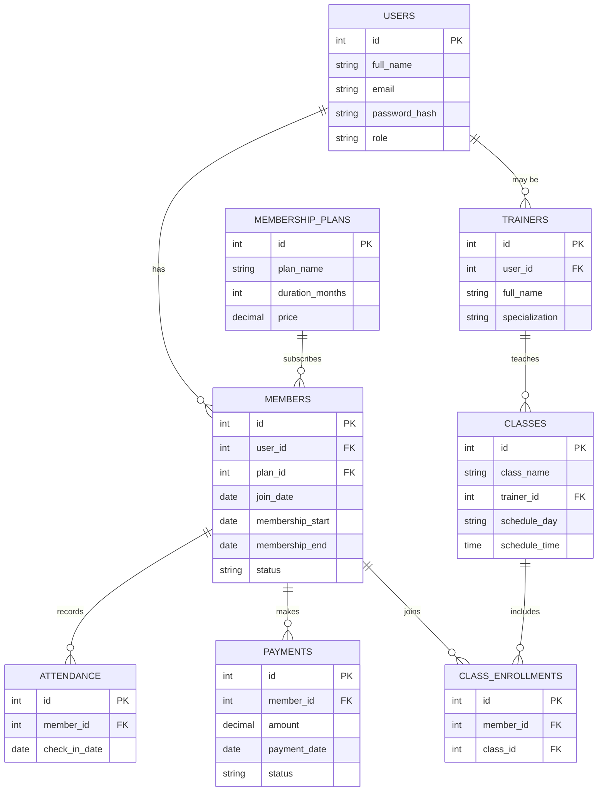
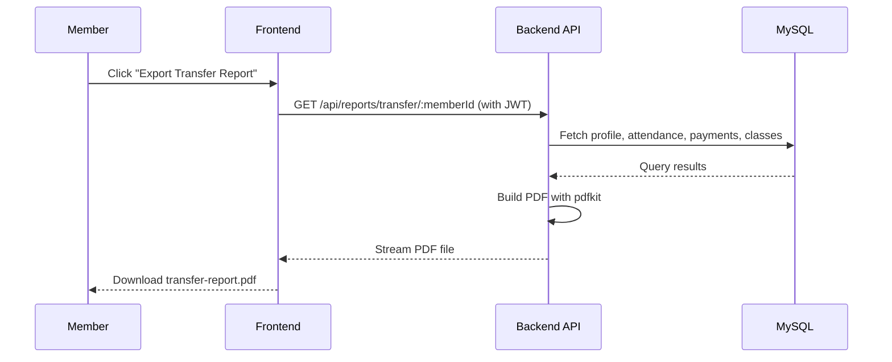

# System Architecture

## Database ERD

```mermaid
erDiagram
    USERS ||--o{ MEMBERS : has
    USERS ||--o{ TRAINERS : "may be"
    MEMBERSHIP_PLANS ||--o{ MEMBERS : subscribes
    MEMBERS ||--o{ ATTENDANCE : records
    MEMBERS ||--o{ PAYMENTS : makes
    MEMBERS ||--o{ CLASS_ENROLLMENTS : joins
    CLASSES ||--o{ CLASS_ENROLLMENTS : includes
    TRAINERS ||--o{ CLASSES : teaches

    USERS {
        int id PK
        string full_name
        string email
        string password_hash
        string role
    }
    MEMBERSHIP_PLANS {
        int id PK
        string plan_name
        int duration_months
        decimal price
    }
    MEMBERS {
        int id PK
        int user_id FK
        int plan_id FK
        date join_date
        date membership_start
        date membership_end
        string status
    }
    TRAINERS {
        int id PK
        int user_id FK
        string full_name
        string specialization
    }
    CLASSES {
        int id PK
        string class_name
        int trainer_id FK
        string schedule_day
        time schedule_time
    }
    CLASS_ENROLLMENTS {
        int id PK
        int member_id FK
        int class_id FK
    }
    ATTENDANCE {
        int id PK
        int member_id FK
        date check_in_date
    }
    PAYMENTS {
        int id PK
        int member_id FK
        decimal amount
        date payment_date
        string status
    }
```

## API Request Flow (Membership Transfer Report)

```mermaid
sequenceDiagram
    participant Member
    participant Frontend
    participant API as Backend API
    participant DB as MySQL

    Member->>Frontend: Click "Export Transfer Report"
    Frontend->>API: GET /api/reports/transfer/:memberId (with JWT)
    API->>DB: Fetch profile, attendance, payments, classes
    DB-->>API: Query results
    API->>API: Build PDF with pdfkit
    API-->>Frontend: Stream PDF file
    Frontend-->>Member: Download transfer-report.pdf
```
