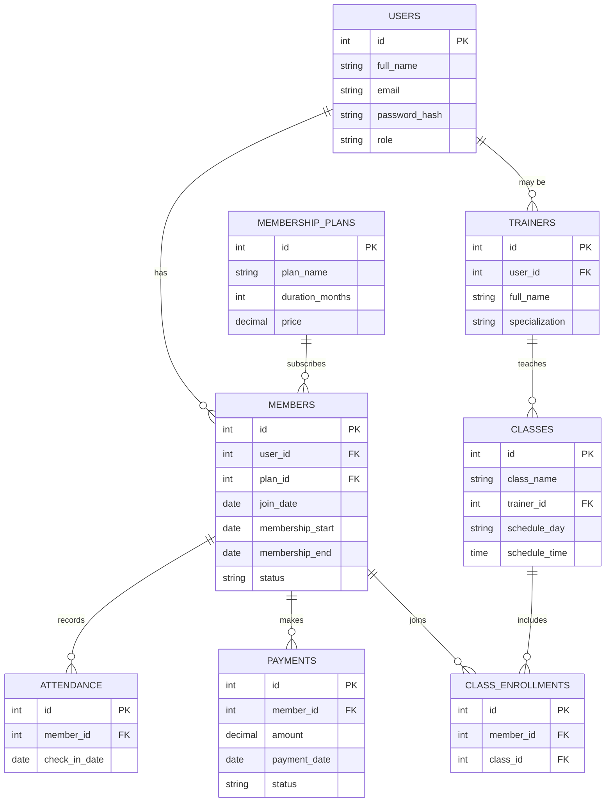
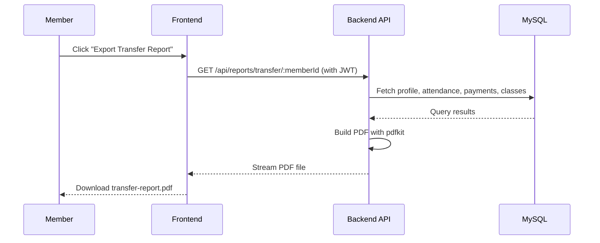
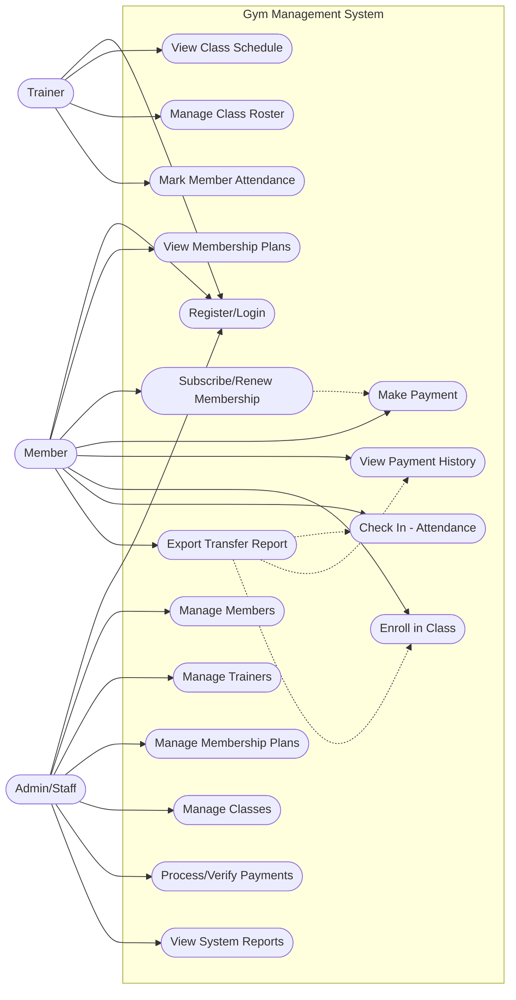

# System Architecture

## Database ERD

```mermaid
erDiagram
    USERS ||--o{ MEMBERS : has
    USERS ||--o{ TRAINERS : "may be"
    MEMBERSHIP_PLANS ||--o{ MEMBERS : subscribes
    MEMBERS ||--o{ ATTENDANCE : records
    MEMBERS ||--o{ PAYMENTS : makes
    MEMBERS ||--o{ CLASS_ENROLLMENTS : joins
    CLASSES ||--o{ CLASS_ENROLLMENTS : includes
    TRAINERS ||--o{ CLASSES : teaches

    USERS {
        int id PK
        string full_name
        string email
        string password_hash
        string role
    }
    MEMBERSHIP_PLANS {
        int id PK
        string plan_name
        int duration_months
        decimal price
    }
    MEMBERS {
        int id PK
        int user_id FK
        int plan_id FK
        date join_date
        date membership_start
        date membership_end
        string status
    }
    TRAINERS {
        int id PK
        int user_id FK
        string full_name
        string specialization
    }
    CLASSES {
        int id PK
        string class_name
        int trainer_id FK
        string schedule_day
        time schedule_time
    }
    CLASS_ENROLLMENTS {
        int id PK
        int member_id FK
        int class_id FK
    }
    ATTENDANCE {
        int id PK
        int member_id FK
        date check_in_date
    }
    PAYMENTS {
        int id PK
        int member_id FK
        decimal amount
        date payment_date
        string status
    }
```

## API Request Flow (Membership Transfer Report)

```mermaid
sequenceDiagram
    participant Member
    participant Frontend
    participant API as Backend API
    participant DB as MySQL

    Member->>Frontend: Click "Export Transfer Report"
    Frontend->>API: GET /api/reports/transfer/:memberId (with JWT)
    API->>DB: Fetch profile, attendance, payments, classes
    DB-->>API: Query results
    API->>API: Build PDF with pdfkit
    API-->>Frontend: Stream PDF file
    Frontend-->>Member: Download transfer-report.pdf
```

Use Case Diagram

```mermaid
flowchart LR
    Member([Member])
    Trainer([Trainer])
    Admin([Admin/Staff])

    subgraph System[Gym Management System]
        UC1([Register/Login])
        UC2([View Membership Plans])
        UC3([Subscribe/Renew Membership])
        UC4([Make Payment])
        UC5([View Payment History])
        UC6([Enroll in Class])
        UC7([Check In - Attendance])
        UC8([Export Transfer Report])
        UC9([View Class Schedule])
        UC10([Manage Class Roster])
        UC11([Mark Member Attendance])
        UC12([Manage Members])
        UC13([Manage Trainers])
        UC14([Manage Membership Plans])
        UC15([Manage Classes])
        UC16([Process/Verify Payments])
        UC17([View System Reports])
    end

    Member --> UC1
    Member --> UC2
    Member --> UC3
    Member --> UC4
    Member --> UC5
    Member --> UC6
    Member --> UC7
    Member --> UC8

    Trainer --> UC1
    Trainer --> UC9
    Trainer --> UC10
    Trainer --> UC11

    Admin --> UC1
    Admin --> UC12
    Admin --> UC13
    Admin --> UC14
    Admin --> UC15
    Admin --> UC16
    Admin --> UC17

    UC3 -.-> UC4
    UC8 -.-> UC7
    UC8 -.-> UC5
    UC8 -.-> UC6
```
